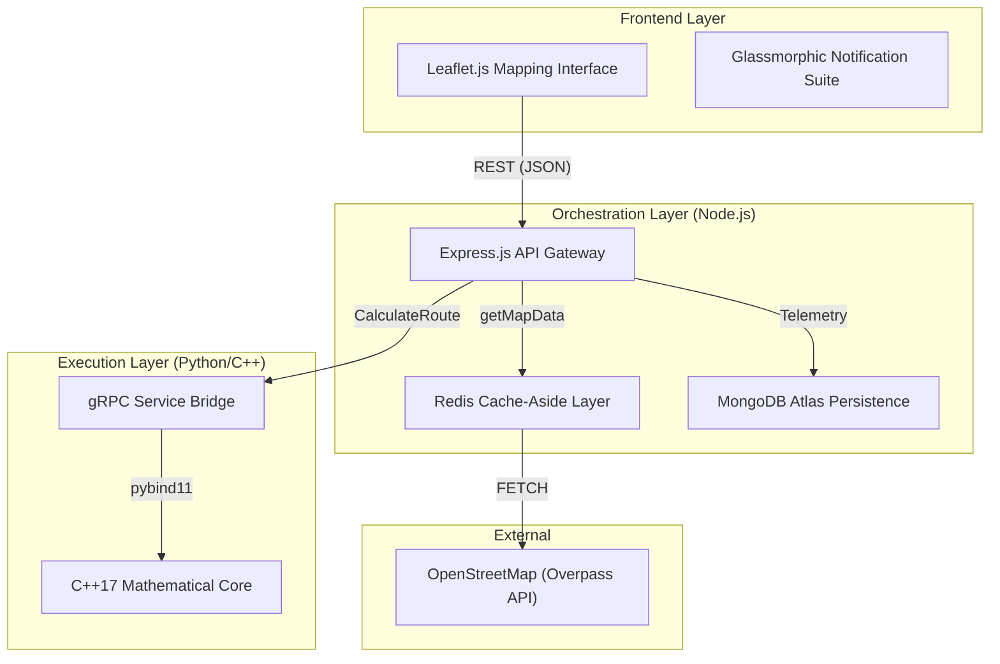
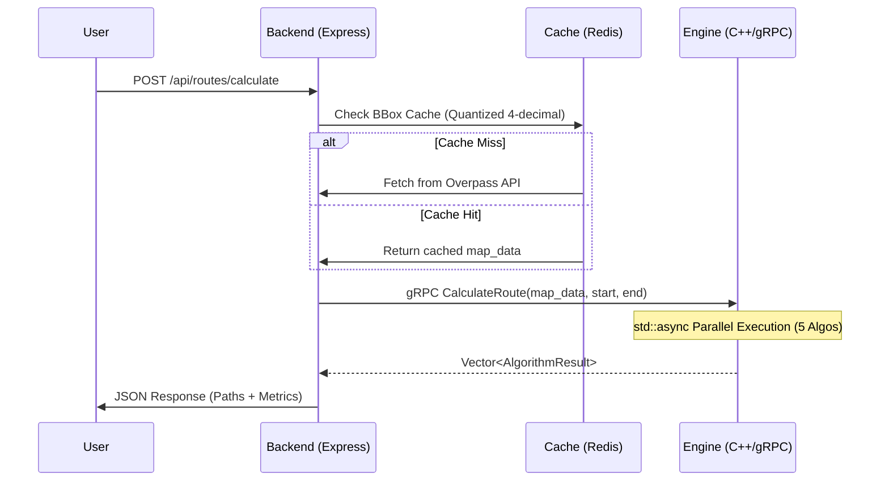

# AI Route Planner

An industrial-grade, multi-objective EV route planning system utilizing a high-performance C++/Python routing engine, Node.js orchestration, and a modern Leaflet-based frontend.

## 🚀 Status: v1.1.0 - Snapshot Created (Stage 4 Complete)
The project has successfully completed **Stage 4: Map Graph Persistence & Protobuf Serialization**. This state provides sub-100ms gRPC ingestion and is archived in the `v1.x` branch.

---

## 🕒 Version History

- **v1.0.0 (v10)**: [Completed] 5 Academic Search algorithms, Dynamic OSM ingestion, L3 traffic complexity. (Snapshot in `v1.x` branch)
- **v1.1.0 (v11)**: [Completed] Map Graph Persistence, Protobuf Serialization, high-speed ingestion. (Snapshot in `v1.x` branch)

---

## 🏗️ System Architecture

### 1.1 High-Level Component Diagram


### 1.2 Request-Response Lifecycle


---

## 📦 Module Ecosystem

| Module | Tech Stack | Primary Responsibility |
| :--- | :--- | :--- |
| **Backend** | Node.js (Express) | API Orchestration, gRPC Client, Async Context Management. |
| **Routing Engine** | C++17, Python, gRPC | Algorithmic Core, Parallel Search Execution, Haversine Heuristics. |
| **Cache** | Redis / Valkey | Geographic Bounding-Box Caching, Coordinate Quantization. |
| **Database** | MongoDB Atlas | User Telemetry, Persistent Metrics, Security-Masked Logging. |
| **Frontend** | Vanilla JS, Leaflet.js | Interactive Mapping, Multi-Layer Polyline Rendering, Glassmorphic UI. |

---

## 🚦 Algorithm Comparison Suite
The routing engine executes 5 distinct algorithms in parallel for every request, providing a "ground-truth" benchmark for search efficiency.

| Algorithm | Optimization | Optimality | Search Strategy |
| :--- | :--- | :--- | :--- |
| **BFS** | $O(V+E)$ | Not Guaranteed | Uninformed breadth-first exploration. |
| **Dijkstra** | $O(E \log V)$ | **Guaranteed** | Greedy priority-based edge relaxation. |
| **IDDFS** | Fringe Search | **Guaranteed** | Iterative depth-first searching (Memory Efficient). |
| **A\*** | Haversine $h(n)$ | **Guaranteed** | Directed search with geographic heuristics. |
| **IDA\*** | Epsilon Banding | **Guaranteed** | Heuristic-driven Iterative Deepening. |

---

## 🛠️ The War Room: Technical Challenges Overcome

### 🧩 Routing Engine: The IDA* Floating Point Pathology
*   **The Issue**: On real-world graphs with `double` costs, the "next threshold" in IDA* would increase by negligible amounts, leading to millions of redundant iterations.
*   **The Resolution**: Implemented **Precision Banding** and **Epsilon Cost-Bucketing** to enforce a minimum threshold jump, maintaining admissibility while restoring performance.

### 📡 Backend: The gRPC Payload Crash
*   **The Issue**: Large urban maps (50MB+) exceeded the default 4MB gRPC message limit, causing `RESOURCE_EXHAUSTED` errors.
*   **The Resolution**: Reconfigured both client and server to support a **100MB payload limit** and verified stability with 40k-node map test cases.

### 📍 Frontend: Multi-Path Overlap Logic
*   **The Issue**: Multiple algorithms often return the same optimal path, causing rendered polylines to overlap and disappear.
*   **The Resolution**: Developed a **Pixel-Space Offset Engine** that bundles identical segments and applies dynamic offsets at `zoomend`, creating a "multi-lane" visualization.

### 🛡️ v2.0.1 Stability Hotfixes (Latest)
*   **Bi-Directional Regression**: Fixed edge-parity loss in Protobuf path; restored 100% search connectivity.
*   **Cache Race Condition**: Extended mutex lock duration in C++ core to prevent dangling references during async search.
*   **Hardcoded IDA* Logic**: Replaced 30 km/h hardcoded fallback with dynamic `max_speed * 0.5` pruning.

---

## 📈 Project Statistics
*Data gathered via `cloc` analysis.*

| Metic | Value |
| :--- | :--- |
| **Total Files** | 9,019 |
| **Total Lines of Code** | 1,203,671 |
| **JavaScript** | 572,452 lines |
| **Python** | 287,143 lines |
| **TypeScript** | 149,440 lines |

---

## 🏔️ Roadmap: The Path Forward

### **Phase 1: Foundation (Current)**
*   **[COMPLETED] Step 1-3**: End-to-end pipeline, Comparison suite, L3 complexity.
*   **[COMPLETED] Step 4**: Map Graph Persistence (Caching) & Protobuf Serialization for sub-100ms ingestion.

### **Phase 2: ML & L4 Complexity (Planned)**
*   **Step 5**: Multi-Objective EV Physics (SoC Constraints, rolling resistance).
*   **Step 8**: Learned Heuristics (RL/GNN) to shrink search space asymptotically.

### **Phase 3: Cognitive Integration (Planned)**
*   **Step 9**: LLM Agentic Navigation Orchestrator for natural language route parsing.

---

## 🚀 Quick Start (Complete Setup)

### 1. Prerequisites
- **Node.js**: v18+ (LTS)
- **Python**: v3.8+ (with `pip`, `venv`)
- **Redis**: v6.2+ (local or Valkey)
- **C++ Compiler**: GCC 9+ or Clang 10+ (supporting C++17)

### 2. Module Setup
Run the following inside each module directory:

```bash
# Backend / Frontend / Cache / Database
npm install

# Routing Engine
python3 -m venv venv
source venv/bin/activate
pip install -r requirements.txt
python3 setup.py build_ext --inplace
```

### 3. Environment Configuration
Create a `.env` in the root directory (using `.env.example` as a template) and configure your `MONGO_URI` and `REDIS_HOST`.

### 4. Running the System
```bash
# Start Valkey/Redis (Terminal 1)
cd modules/cache && valkey-server --daemonize yes

# Start Routing Engine (Terminal 2)
cd modules/routing_engine && python3 server.py
# For Algo Debug Mode
# ALGO_DEBUG=true python server.py

# Start Backend (Terminal 3)
cd modules/backend && npm run dev
```
Navigate to `http://localhost:5500` to start planning.

### 5. Reset System for CLean Run
```bash
# Clear Valkey/Redis
cd modules/cache && valkey-cli FLUSHALL

# Clear MongoDB
cd modules/database && npm run reset

# Clear C++ Cache
cd modules/routing_engine
## Press Ctrl+C to stop the server
python server.py
```
---
*Refer to individual `modules/<name>/README.md` for deep-dive technical specs.*
