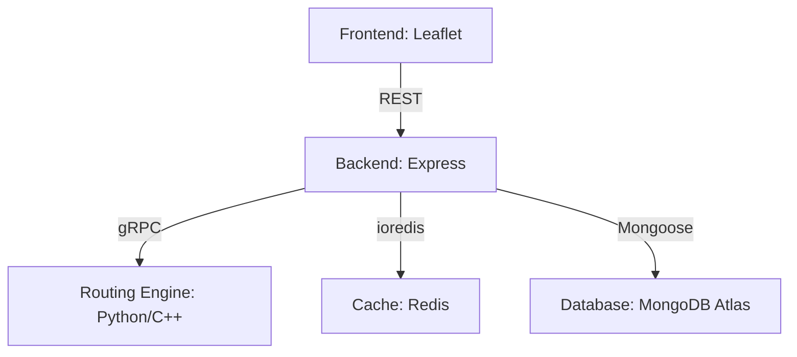

# AI Route Planner

An industrial-grade, multi-objective EV route planning system utilizing a high-performance C++/Python routing engine, Node.js orchestration, and a modern Leaflet-based frontend.

## 🚀 Status: Stage 1 Complete ✅
The "Tracer Bullet" phase is finished. The end-to-end pipeline from the browser through the API gateway to the C++/Python core is validated and verified.

## 🏗️ Architecture

## 📂 Project Structure
- `modules/backend`: Node.js API Gateway and service orchestrator.
- `modules/routing_engine`: Python/C++ core with gRPC interface.
- `modules/cache`: Redis-based caching layer.
- `modules/database`: MongoDB Atlas persistence layer.
- `modules/frontend`: Vanilla HTML/JS mapping interface.
- `tests/`: Centralized test suite for all modules.

**Core Objective:**
To build an industrial-grade, robust, full-stack, location-independent multi-objective Electric Vehicle (EV) Route Planning system (Level 4 Complexity). It performs constrained multi-objective optimization (minimizing travel time and energy consumption while ensuring battery State of Charge constraints) using real road networks to find Pareto-optimal routes. Designed to handle simultaneous multi-user requests in real-time using parallel computing and eventually integrate ML enhancements and an LLM-powered navigation agent.

## Architecture and Technology Stack

The project operates under a strict, modular development framework. Cross-module edits are forbidden unless operating in an Integration workspace.

**Module Breakdown & Tech Stack:**

1. **Frontend (`modules/frontend/`)**: mapping UI, multi-criteria sliders, and Pareto-optimal path selection.
   - *Tech Stack*: Vanilla HTML, CSS, JS with **Leaflet.js + OSM raster tiles**.
   - *Reason*: Leaflet.js is lightweight, free, and straightforward for the immediate needs of initial phases without the overhead of MapLibre GL JS or OpenLayers.
2. **Backend (`modules/backend/`)**: API Gateway, business logic, handling concurrent users.
   - *Tech Stack*: **Node.js with Express.js**.
   - *Reason*: High scalability for I/O operations and parallel request handling utilizing Node clusters and worker threads for real-time usage.
3. **Routing Engine (`modules/routing_engine/`)**: Core algorithmic logic computing physics-based edge costs, processing Dijkstra, A*, Multiobjective Dijkstra (MDA).
   - *Tech Stack*: **C++ integrated into Python via `pybind11`**, communicating via **gRPC**.
   - *Reason*: Python wraps the service well, but C++ guarantees industrial-grade speed for heavy Level 4 complexity calculations. gRPC is the industry standard for fast, high-density data transfer over REST in microservice interconnectivity.
4. **Data Ingestion (Internal to Routing Engine)**: Dynamic map fetching.
   - *Tech Stack*: **Geographic Caching + Redis** (Node.js background worker pre-fetching neighboring bounding boxes).
   - *Reason*: Free, completely location independent, and mitigates cold starts dynamically. Avoids reliance on OpenRouteService API limits.
5. **Cache (`modules/cache/`)**: Shared cache for route queries.
   - *Tech Stack*: **Redis**.
   - *Reason*: Extremely fast, in-memory data store for minimizing duplicate compute requests.
6. **Database (`modules/database/`)**: Persistence layer for telemetry and ML data.
   - *Tech Stack*: **MongoDB Atlas**.
   - *Reason*: Non-relational, flexible schema storage perfect for varying telemetry documents and future ML training data sets.

## Implementation Strategy & Phasing

### Phase 1: D3 Foundation
- **Focus**: Build the backend, frontend, layout the hybrid C++/Python core routing engine foundation (A* and MDA), Redis cache integration, and Node clusters. Setup initial MongoDB persistence layer.
- **Use Case**: End-user opens the web mapping UI, selects a starting point in a city and a destination in another city. The UI sliders allow weighting of Time vs Energy. The system transparently fetches OSM road networks, dynamically computes the graph, and the C++ engine determines the Pareto-optimal routes using physical multi-objective constants (rolling resistance, aerodynamic drag, grade resistance). Route is returned efficiently due to Redis caching and plotted over the map. Data of the query is logged to MongoDB.

### Phase 2: ML/AI & Learned Heuristics
- **Focus**: Implement Learned Heuristics using Reinforcement Learning (RL/GNN) trained on user telemetry and historical queries.
- **Use Case**: A user queries a particularly complex routing problem across an entire state. Instead of relying purely on naive A* heuristics, the routing engine queries the learned model from the database telemetry, vastly shrinking the search space and returning highly optimized paths much faster than classical methods.

### Phase 3: Agentic UI
- **Focus**: Integrate an LLM-powered Routing Agent parsing natural language requests seamlessly.
- **Use Case**: User types/speaks: "I need to get to Central Park by 5 PM, but I want to arrive with at least 30% battery remaining." The LLM Navigation agent parses these natural language constraints into specific parameters, queries the API, and displays exactly the routes that satisfy those conditions.

## Development Rules
- **Testing**: Central test runner (`tests/main_test_runner.js`) manages aggressive algorithmic unit tests, cache hit/miss tests, and high concurrency load tests (Artillery/K6). Tests must pass before proceeding between phases.
- **Code Style**: Strict JSDoc/TypeScript-like documentation.
- **Error Handling**: Graceful Try/Catch error catching across algorithmic transitions, standardizing API JSON error outputs. 
- **Logging**: Centralized Winston/Morgan for request lifecycle tracking.
