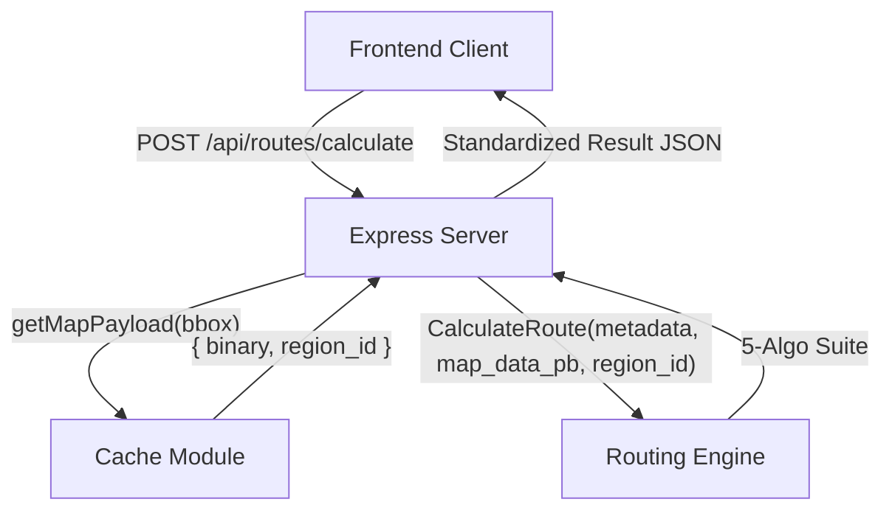
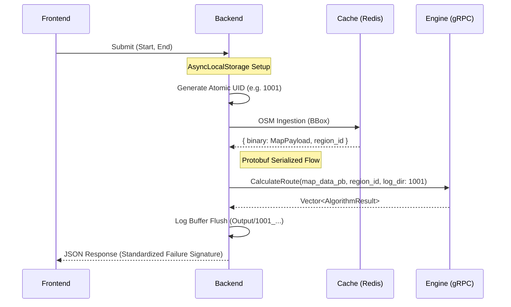

# Backend Orchestration Module

High-performance, event-driven orchestration layer implemented in Node.js. Serves as the central nerve center for the AI Route Planner, coordinating real-time OSM data ingestion, Redis caching, and gRPC pathfinding execution.

## 1. System Architecture

### 1.1 High-Level Flow


### 1.2 Orchestration Lifecycle


## 2. Architectural Breakthroughs (Post-v1.0.0)

### 2.1 The "City-Scale" Ingestion (Protobuf v2)
*   **The Problem**: Requesting a route across a high-density urban center (e.g., New York) generates a 50MB+ OSM road network. Standard gRPC payloads are limited to 4MB, and single-threaded JSON parsing can block the Node.js event loop.
*   **The Solution**: **Protobuf Binary Serialization**. We transitioned from JSON stringification to binary `MapPayload` buffers (`map_data_pb`). This reduces I/O time and offloads deserialization to the C++ core.
*   **Outcome**: Sub-1ms overhead in the primary orchestration thread for massive urban road networks.

### 2.2 Unified Request Tracing (`AsyncLocalStorage`)
*   **The Problem**: Debugging a distributed search (Backend -> Cache -> Engine) was impossible without a shared identifier to link log fragments.
*   **The Solution**: **Atomic UID & Log Buffering**. Using `AsyncLocalStorage`, we maintain a per-request buffer that collects traces from all asynchronous layers. These are flushed to a single session folder (e.g., `Output/1001_...`) upon completion.
*   **Outcome**: 100% observability across the entire request lifecycle.

### 2.3 Semantic Error Mapping & Circuit Breakers
*   **The Problem**: Timeouts or "Silent" OSM failures would return misleading results (e.g., 0m distance routes).
*   **The Solution**: **Semantic Mapping (504/503)**. The backend now maps gRPC `DEADLINE_EXCEEDED` to `504` and `UNAVAILABLE` to `503`.
*   **The Failure Signature**: When an algorithm exceeds `ALGO_MAX_NODES`, the backend enforces a standardized response: `distance: 0`, `path_cost: 0`, `nodes_expanded: 1,000,001`, and `circuit_breaker_triggered: true`.

### 2.4 High-Fidelity EV Visualization (v2.5.0 Sync)
*   **The Problem**: Displaying a simple polyline lacks granularity for regenerative braking performance or steep incline consumption tracking.
*   **The Solution**: **Segment-Level Propagation**. The backend now iterates through the C++ search results to explicitly preserve `segment_consumed_kwh` for every coordinate.
*   **Outcome**: Enables the frontend to render "heatmaps" of energy consumption across the route in real-time.

## 3. API & Contracts

### POST `/api/routes/calculate`
| Field | Type | Description |
| :--- | :--- | :--- |
| `start/end` | `Object` | `{ lat: number, lng: number }` |
| `mock_hour` | `Number` | Simulation time (0-23) for traffic weighting. |
| `objective` | `String` | `"FASTEST"` or `"SHORTEST"`. |
| **EV Parameters** | | (Pass in `req.body` or `req.body.ev_params`) |
| `enabled` | `Boolean` | Activates EV physics-based routing. |
| `vehicle_id` | `String` | (Optional) 'tesla_model_3', 'standard_ev'. |
| `effective_mass_kg`| `Number` | (Override) Absolute total vehicle mass. |
| `start_soc_kwh` | `Number` | (Override) Absolute starting energy in kWh. |
| `payload_kg` | `Number` | (Optional) Added to profile tare (if no mass override). |
| `drag_coeff` | `Number` | (Override) Aerodynamic coefficient (Cd). |
| `target_charge_bound_kwh`| `Number` | (v2.5.0) Absolute mission charge limit. |
| `is_emergency_assumption`| `Boolean`| (v2.5.0) Treat unknown chargers as wall-plugs. |

### 3.1 The Hybrid EV Contract (Stage 5)
The backend supports two distinct orchestration paths for EV missions:
1.  **Profile Mode**: Provide a `vehicle_id`. The backend fetches OEM coefficients and adds your `payload_kg`.
2.  **Custom Mode**: Provide `effective_mass_kg` and/or `start_soc_kwh`. These absolute values bypass profile lookups, ideal for specialized or pre-validated missions.
3.  **Zero-Configuration**: Simply sending `{"enabled": true}` triggers a mission using `standard_ev` defaults and 80% SoC, ensuring non-blocking execution.


**Standard Response**: Encapsulates 5 algorithm results with physics-based metrics (`arrival_soc_kwh`, `consumed_kwh`). Every `polyline` point contains `segment_consumed_kwh`.

## 4. The War Room: Bugs Faced & Solved

### 4.1 The gRPC `RESOURCE_EXHAUSTED` Crash
**Issue**: Large map data payloads caused immediate connection resets during gRPC transmission between Backend and Engine.
**Solution**: Configured the gRPC client to use `grpc.max_send_message_length: 52428800`. Verified the fix with a 40k-node map ingestion test.

### 4.2 The `target` Scope ReferenceError
**Issue**: A regression during refactoring caused the `target` connection string in `grpcClient.js` to be undefined at runtime.
**Solution**: Restored the `process.env.ROUTING_ENGINE_URL` variable with a hardcoded fallback to `localhost:50051`, and updated the **Quality Guardian** protocol to catch variable-scoping errors during unit tests.

### 4.3 The Async Context Leak
**Issue**: Requests would occasionally hang because `AsyncLocalStorage` context was not being unregistered in error blocks.
**Solution**: Implemented a mandatory `finally` block in the controller to ensure `unregisterContext()` is called regardless of request outcome.

### 4.4 The "Silent" OSM Failure (1-Node Path)
**Issue**: When the OSM API failed (504), the backend would log a warning but proceed to call the Routing Engine with empty map data, resulting in a misleading "successful" response with a 0m distance route.
**Solution**: Refactored `calculateRoute.js` to treat OSM ingestion as mandatory. Failures now trigger an immediate 503 response. Improved stability via `OSM_TIMEOUT_MS` (30s) cutoff.

### 4.5 The "Partial Result" UI Ghosting
**Issue**: When IDA* hit its circuit breaker, it might return a partial path or null data, causing inconsistent frontend displays.
**Solution**: Standardized the **Failure Signature** in the backend. When `ALGO_MAX_NODES` is exceeded, the backend now returns `path_cost: 0`, `distance: 0`, and `nodes_expanded: 1,000,001`, explicitly flagging the failure for the frontend toasts.
**Optimization**: To prevent trace logs from bloating to 99MB+ for long routes, `requestLogger.js` now intercepts all successful route responses and logs a summarized metadata object (`algorithm`, `distance`, `nodes_expanded`, `nodes_in_path`) instead of raw coordinate arrays.

### 4.6 The Engine Mock Poisoning
**Issue**: The backend was passing `DEBUG=true` straight to the Routing Engine as `debug-mode`, causing it to bypass all search algorithms and return mock `DUMMY_TRACER` results mistakenly.
**Solution**: Decoupled the engine simulation from application-level debug logging. The engine now only enters mock mode if `ENGINE_SIMULATOR=true` is explicitly set.

## 5. Configuration (Environment Variables)

| Variable | Default | Description |
| :--- | :--- | :--- |
| `PORT` | `3000` | Express server port. |
| `ROUTING_ENGINE_URL` | `localhost:50051` | Target address for the C++/Python search engine. |
| `GRPC_MAX_MESSAGE_SIZE` | `50MB` | Binary payload limit for large map ingestion. |
| `OSM_TIMEOUT_MS` | `30s` | Configurable cutoff for upstream map fetching. |
| `OSM_REQ_RETRY_COUNT` | `3` | Number of retries for OSM 503/504 errors. |
| `ALGO_KILL_TIME_MS` | `60,000` | Hard time-limit (ms) for search algorithms (0 = disable).|
| `ALGO_DEBUG_NODE_INTERVAL` | `5000` | (v2.3.0) Granular node tracing interval for C++. |
| `ALGO_MAX_NODES` | `10M` | Absolute expansion limit for circuit breaker. |
| `ALGO_DEBUG` | `false` | (v2.3.0) Strictly enables search tracing in the Engine. |
| `ENGINE_SIMULATOR` | `false` | (v2.2.1) Explicitly triggers Routing Engine mock mode. |
| `ROUTING_EPSILON_MIN` | `10.0` | Search relaxation threshold (v2.1.2). |
| `ROUTING_IDA_BANDING_SHORTEST` | `10.0` | Shortest-path banding factor (v2.1.2). |
| `ROUTING_IDA_BANDING_FASTEST` | `1.0` | Fastest-path banding factor (v2.1.2). |

## 6. Build and Lifecycle

### 6.1 Run Development Server
```bash
npm run dev
```

### 6.2 Execute Tests
```bash
node tests/main_test_runner.js
```

## 7. System Integration & Use Cases

### 7.1 Extending Request Context
To add a new cross-module metric (e.g., telemetry):
1. Add the field to the `context` object in `calculateRoute.js`.
2. Access the field anywhere in the request flow via `storage.getStore()`.

### 7.2 Modifying API Contracts
If you update the gRPC interface in the Engine:
1. Update `proto/route_engine.proto`.
2. The `grpcClient.js` will automatically load the new definition on restart.
