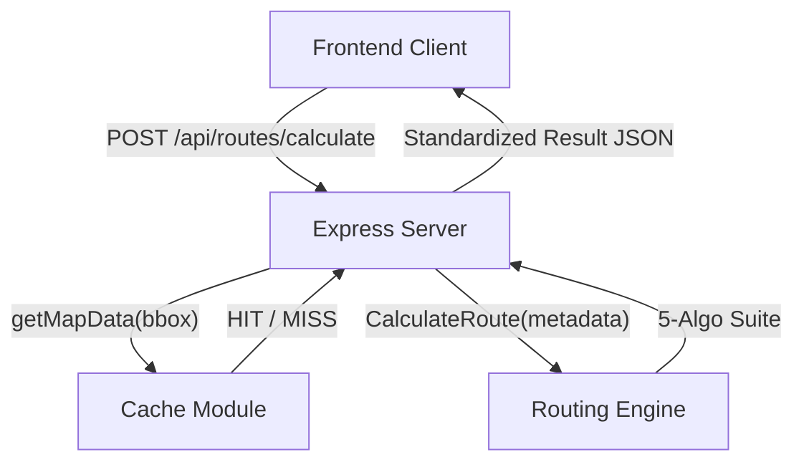
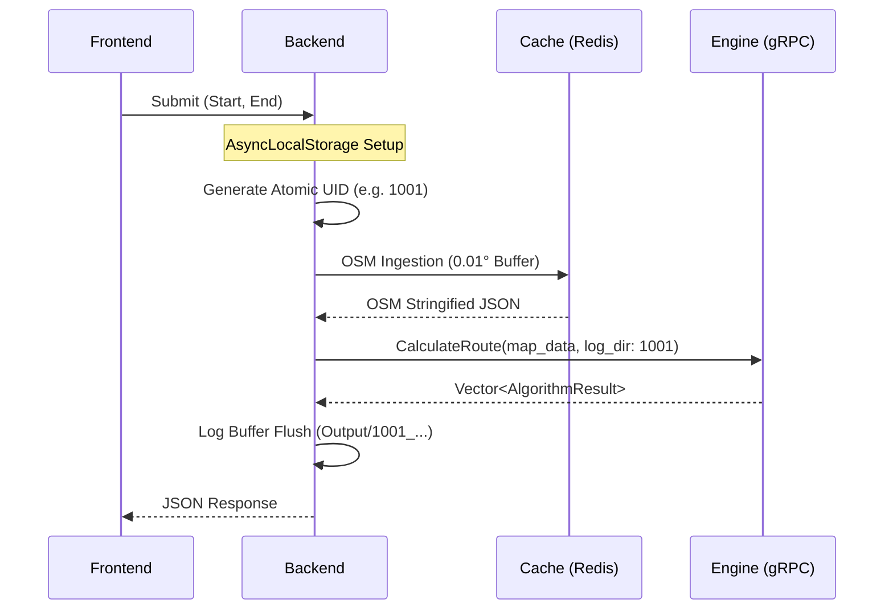

# Backend Orchestration Module

High-performance, event-driven orchestration layer implemented in Node.js. Serves as the central nerve center for the AI Route Planner, coordinating real-time OSM data ingestion, Redis caching, and gRPC pathfinding execution.

## 1. System Architecture

### 1.1 High-Level Flow


### 1.2 Orchestration Lifecycle


## 2. Real-World Scenarios

### Scenario A: The "City-Scale" Ingestion
*   **The Problem**: Requesting a route across a high-density urban center (e.g., New York) generates a 50MB+ OSM road network. Standard gRPC payloads are limited to 4MB, and single-threaded JSON parsing can block the Node.js event loop.
*   **The Solution**: Increased `GRPC_MAX_MESSAGE_SIZE` to **100MB** and implemented **quantized bounding boxes** to stabilize cache keys.
*   **Module Behavior**: The backend successfully transmits massive map corridors to the C++ core while maintaining sub-10ms overhead in the primary orchestration thread.

### Scenario B: Safe-Fail Fallback
*   **The Problem**: The OSM Overpass API or the local Redis instance is intermittently unreachable during a request.
*   **The Solution**: **"Cache-Optional" Strategy**.
*   **Module Behavior**: If the `modules/cache` service throws an error, the backend catch-block logs a `[WARN]`, ignores the `map_data` field, and proceeds with the Routing Engine's static static data, ensuring user requests never fail due to upstream map provider issues.

## 3. API & Contracts

### POST `/api/routes/calculate`
| Field | Type | Description |
| :--- | :--- | :--- |
| `start/end` | `Object` | `{ lat: number, lng: number }` |
| `mock_hour` | `Number` | Simulation time (0-23) for traffic weighting. |
| `objective` | `String` | `"FASTEST"` or `"SHORTEST"`. |

**Standard Response**: Encapsulates 5 algorithm results (BFS, Dijkstra, IDDFS, A*, IDA*) with polylines and performance metrics.

## 4. The War Room: Bugs Faced & Solved

### 4.1 The gRPC `RESOURCE_EXHAUSTED` Crash
**Issue**: Large map data payloads caused immediate connection resets during gRPC transmission between Backend and Engine.
**Solution**: Configured the gRPC client to use `grpc.max_send_message_length: 52428800`. Verified the fix with a 40k-node map ingestion test.

### 4.2 The `target` Scope ReferenceError
**Issue**: A regression during refactoring caused the `target` connection string in `grpcClient.js` to be undefined at runtime.
**Solution**: Restored the `process.env.ROUTING_ENGINE_URL` variable with a hardcoded fallback to `localhost:50051`, and updated the **Quality Guardian** protocol to catch variable-scoping errors during unit tests.

### 4.3 The Async Context Leak
**Issue**: Requests would occasionally hang because `AsyncLocalStorage` context was not being unregistered in error blocks.
**Solution**: Implemented a mandatory `finally` block in the controller to ensure `unregisterContext()` is called regardless of request outcome.

## 5. Configuration (Environment Variables)

| Variable | Default | Description |
| :--- | :--- | :--- |
| `PORT` | `3000` | Express server port. |
| `ROUTING_ENGINE_URL` | `localhost:50051` | Target address for the C++/Python search engine. |
| `GRPC_MAX_MESSAGE_SIZE` | `50MB` | Payload limit for large map ingestion. |
| `DEBUG` | `false` | Enables full request/response console logging. |

## 6. Build and Lifecycle

### 6.1 Run Development Server
```bash
npm run dev
```

### 6.2 Execute Tests
```bash
node tests/main_test_runner.js
```

## 7. System Integration & Use Cases

### 7.1 Extending Request Context
To add a new cross-module metric (e.g., telemetry):
1. Add the field to the `context` object in `calculateRoute.js`.
2. Access the field anywhere in the request flow via `storage.getStore()`.

### 7.2 Modifying API Contracts
If you update the gRPC interface in the Engine:
1. Update `proto/route_engine.proto`.
2. The `grpcClient.js` will automatically load the new definition on restart.
