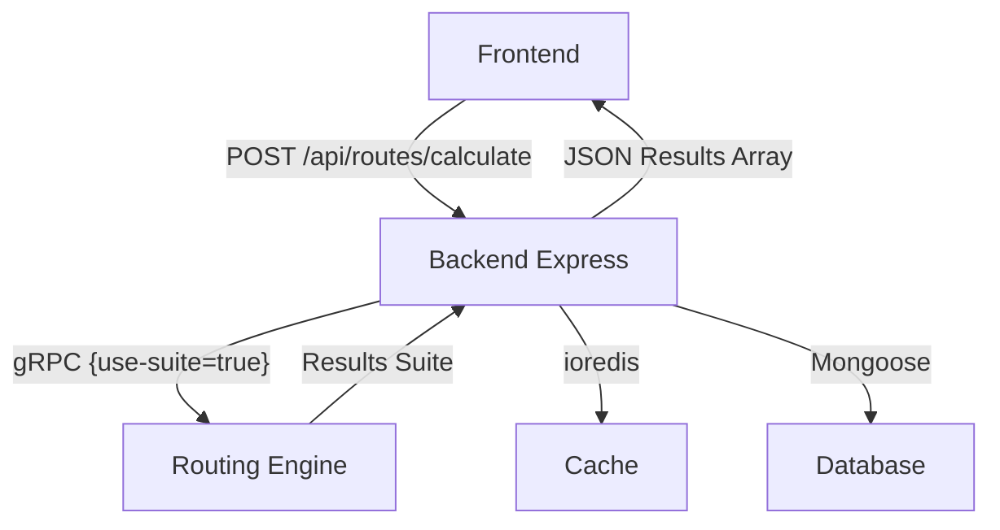

# Backend Module

The Backend module serves as the central orchestration layer for the AI Route Planner. It exposes a RESTful API to the frontend and interfaces with specialized microservices via gRPC and standard protocols.

## 🚀 Quick Start

1. Install dependencies:
   ```bash
   npm install
   ```
2. Configure `.env`:
   ```env
   PORT=3000
   DEBUG=true
   ```
3. Run in development:
   ```bash
   npm run dev
   ```

## 🏗️ Architecture



- **Step 3 (Current)**: Orchestrates the **Academic Search Suite**.
- **Comparative Search**: Aggregates 5 algorithms (BFS, Dijkstra, IDDFS, A*, IDA*) with performance telemetry.
- **L3 Dynamic Weighting**: Supports `mock_hour` and `objective` parameters for traffic-aware routing.
- **Standardized Schema**: Enforces the `AlgorithmResult` interface for consistent frontend consumption.

## 🛠️ API & Contracts

### POST `/api/routes/calculate`
Primary endpoint for search requests.
- **Input**: Geographic coordinates, `mock_hour` (0-23), and `objective` (FASTEST/SHORTEST).
- **Output**: Array of search results including path polyline, distance, duration, and academic metrics (nodes expanded, exec time).

## 🛠️ Tech Stack
- **Node.js**: Asynchronous runtime.
- **Express.js**: Web framework.
- **gRPC**: High-performance communication with the Routing Engine.
- **Jest**: Unit and integration testing.

## 🧪 Testing
Run tests from the module directory:
```bash
npm test
```
Or target specific files:
```bash
npm test -- ../../tests/backend/calculateRoute.test.js
```
## Design Rules
- Centralized Try/Catch wrappers around every router method.
- Standardized REST JSON errors `{ error: true, code: XXX, message: "..." }`.

*Refer to `module-spec.md` for full implementation boundaries.*
