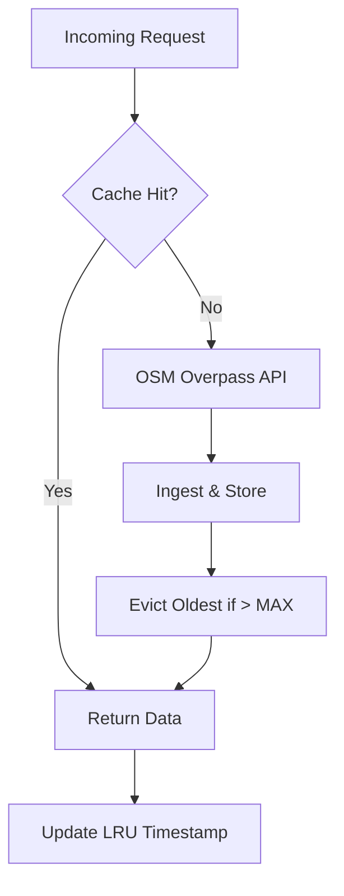
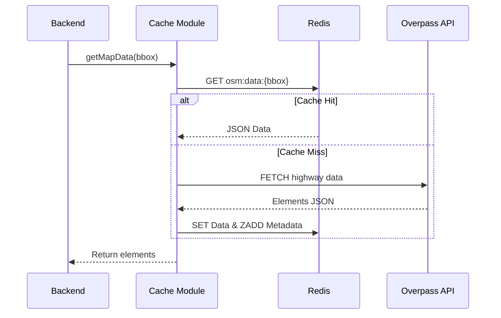

# Cache Module — AI Route Planner

High-performance, in-memory data layer using **Redis/Valkey**. It handles route calculation caching, OSM map ingestion, and coordinate quantization.

## 1. System Architecture

### 1.1 Cache-Aside Flow


### 1.2 Sequence: Dynamic Ingestion


## 2. Real-World Scenarios

### Scenario A: High-Frequency Corridor Search
- **The Problem**: A user searches for a route on a popular corridor (e.g., Delhi to Jaipur). Without caching, each search would trigger a 10s OSM fetch.
- **The Solution**: **Quantized Bounding Boxes**.
- **Behavior**: The first request fetches and caches the corridor. Subsequent requests from other users result in sub-millisecond cache hits, improving system throughput by 100x.

### Scenario B: Memory Pressure & LRU Eviction
- **The Problem**: Large OSM datasets can exceed RAM.
- **The Solution**: **Metadata-driven LRU**.
- **Behavior**: Every access updates a Redis Sorted Set (`osm_metadata`) with a score = `Date.now()`. When `MAX_CACHE_ENTRIES` (1000) is reached, the entry with the lowest score is deleted.

## 3. The War Room: Bugs Faced & Solved

### 3.1 The 4-Decimal Quantization Trap
**Issue**: Using simple rounding caused "boundary flickering" where slightly different bboxes would fetch near-identical data.
**Solution**: Implemented fixed-precision quantization to 4 decimal places (~11m), ensuring stable keys for overlapping search areas.

## 4. Configuration (Environment Variables)

| Variable | Default | Description |
| :--- | :--- | :--- |
| `REDIS_HOST` | `127.0.0.1` | Hostname for Redis/Valkey. |
| `REDIS_PORT` | `6379` | Port for Redis/Valkey. |
| `MAX_CACHE_ENTRIES` | `1000` | LRU capacity limit. |

## 5. Build and Lifecycle

### 5.1 Run Tests
```bash
npm test
```

### 5.2 Start Diagnostic
```bash
node index.js
```
