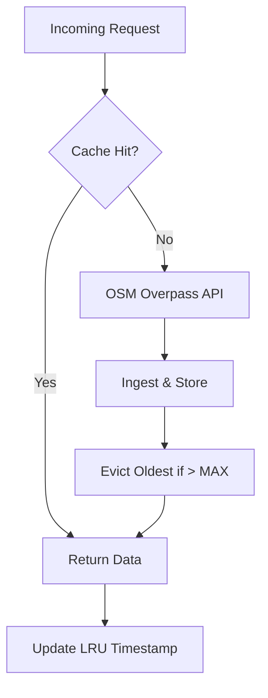
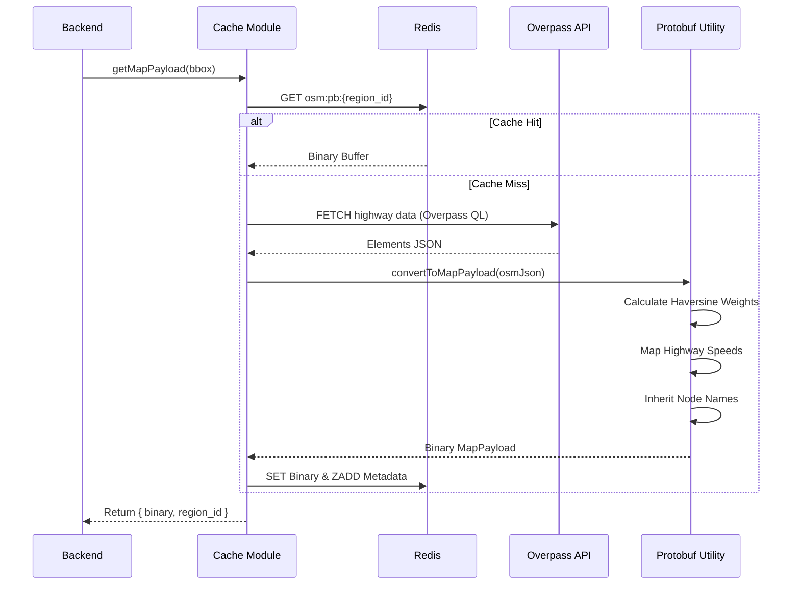

# Cache Module — AI Route Planner

High-performance, in-memory data layer using **Redis/Valkey**. It handles route calculation caching, OSM map ingestion, and coordinate quantization.

## 1. System Architecture

### 1.1 Cache-Aside Flow


### 1.2 Sequence: Dynamic Ingestion (v2.0 Protobuf)


## 2. Real-World Scenarios

### Scenario A: High-Frequency Corridor Search
### Ingestion Flow (v2.0)
1. **BBox Calculation**: Backend generates a geographic bounding box.
2. **Region Hashing**: CacheQuantizes coordinates to 4 decimals and creates a `region_id` (`bbox:minLat_minLon_maxLat_maxLon`).
3. **Redis Lookup**: Checks for binary data under `osm:pb:<quantized_bbox_string>`.
4. **OSM Fetch (Miss)**: Fetches JSON from Overpass API.
5. **Protobuf Transform**:
    - Maps OSM 64-bit IDs to `int32` sequential internal IDs.
    - Extracts `NodeProto` names from node tags or way inheritance (e.g., "(Main Street)").
    - Calculates `weight_m` (Haversine) for every segment.
    - Maps `maxspeed` and `highway` tags to `speed_kmh`.
6. **Persistence**: Stores the binary `MapPayload` in Redis and updates LRU metadata.

### Scenario B: Resilient Map Ingestion
- **The Architecture**: Uses a shared `withCacheAside` HOF to handle both Protobuf (modern) and JSON (legacy) caching logic.
- **Resilience Strategy**: 
    - **Exponential Backoff**: Retries Overpass API calls on 503/504 errors (Starts at 2s, doubling).
    - **Standardized Failure**: If a region has no roads (e.g., Ocean), the module returns a valid, empty `MapPayload` instead of throwing. This allows the routing engine to report "No Path" correctly.
    - **Client-Side Safeguard**: `AbortController` triggers after `OSM_TIMEOUT_MS` to prevent hanging requests.

### Scenario C: Memory Pressure & LRU Eviction
- **The Problem**: Large OSM datasets can exceed RAM.
- **The Solution**: **Metadata-driven LRU**.
- **Behavior**: Every access updates a Redis Sorted Set (`osm_metadata`) with a score = `Date.now()`. When `MAX_CACHE_ENTRIES` (1000) is reached, the entry with the lowest score is deleted from both the data key and the metadata set.

## 3. The War Room: Bugs Faced & Solved

### 3.1 The NaN Weight Pathology
**Issue**: Missing or malformed OSM coordinate data could lead to `NaN` values for `weight_m`, causing the C++ routing engine's priority queues to fail.
- **Resolution**: Implemented strict validation for `lat`/`lng` pairs before `calculateHaversine`.
- **Safety Fallback**: Added a default of `1.0` if distance calculation fails to ensure system stability.

### 3.2 The 4-Decimal Quantization Trap
- **Protobuf Serialization**: Produces binary `MapPayload` (Nodes, Edges) for high-performance ingestion.
- **Topological Conversion**: Pre-calculates Haversine weights and maps OSM tags to legal speed limits.
- **Quantization**: Forced 4-decimal precision (~11m) for stable region identifiers.
- **LRU Binary Cache**: Stores serialized buffers under `osm:pb:<region>` to eliminate parsing overhead.
- **Concurrent Safety**: Promise-based memoization prevents redundant Overpass API fetches.

- **Inheritance Logic**: Implemented way-name propagation where a node without its own `name` tag inherits the name of its parent `way`. Ensures logs display "(Main Street)" correctly.

### 3.4 The 504 Gateway Timeout & "Ocean" Problem
**Issue**: High traffic results in 504 errors; empty map regions result in system crashes.
- **Resolution**:
    - **Backoff & Retries**: Implemented exponential backoff for server-side errors.
    - **Standardized Failures**: Returning empty `MapPayload` for zero-node results ensures the routing engine terminates gracefully.
- **Double Timeouts**: Added `[timeout:25]` server-side hint and 30s `AbortController` client-side timeout.
- **Better Debugging**: Inclusion of HTTP status codes in thrown errors for faster triaging.

### 3.5 The Jest Timeout Regression
- **The Problem**: Retry logic in `osmWorker.js` caused unit tests to exceed the default 5s Jest timeout.
- **The Solution**: Switched to `jest.useFakeTimers()` in the test suite to instantly fast-forward through backoff delays, ensuring 100% test coverage for error paths without real-world latency.

## 4. Configuration (Environment Variables)

| Variable | Default | Description |
| :--- | :--- | :--- |
| `REDIS_HOST` | `127.0.0.1` | Hostname for Redis/Valkey. |
| `REDIS_PORT` | `6379` | Port for Redis/Valkey. |
| `MAX_CACHE_ENTRIES` | `1000` | LRU capacity limit. |
| `OSM_TIMEOUT_MS` | `30000` | Client-side fetch timeout (ms). |
| `OSM_REQ_RETRY_COUNT` | `3` | Number of retries for 503/504 errors. |

## 5. Build and Lifecycle

### 5.1 Start Server

To start the Valkey server (the high-performance, open-source alternative to Redis used in this project), you can use the following methods depending on your installation:

#### 1. Direct Binary Execution (Recommended for Development)
If you have Valkey installed on your system path, run:

```bash
valkey-server
```
- *If you want to run it in the background, add the `--daemonize yes` flag.*

#### 2. Linux System Service (Systemd)
If you installed it via a package manager (`apt`, `dnf`), use:
```bash
sudo systemctl start valkey
```
- To check the status: `sudo systemctl status valkey`

#### 3. Docker
If you don't have it installed natively but have Docker:
```bash
docker run --name valkey-server -p 6379:6379 -d valkey/valkey:latest
```

#### 4. Verification
Once started, you can verify the connection using the `valkey-cli` (similar to `redis-cli`):
```bash
valkey-cli ping
# Expected Output: PONG
```

- The Cache module in `modules/cache/.env` is configured to look for the server at `127.0.0.1:6379` by default. If you start Valkey on a different port, make sure to update the `.env` file accordingly.

### 5.2 Clear Valkey/Redis
```bash
valkey-cli FLUSHALL
```

### 5.1 Run Tests
```bash
npm test
```

### 5.2 Start Diagnostic
```bash
node index.js
```

### 5.3 OSM Robustness Test
To verify the exponential backoff and timeout handling, run the dedicated test script:

```bash
node tests/verify_osm_robustness.js
```

#### Expected Outcomes:
- **Retry Logic (Test 1)**:
    - Simulates `504 Gateway Timeout` errors.
    - **Step 1**: Returns 504. Retries after ~2000ms.
    - **Step 2**: Returns 504. Retries after ~4000ms.
    - **Step 3**: Returns 200. Verification succeeds.
- **Timeout Handling (Test 2)**:
    - Simulates a hung API connection.
    - **Behavior**: `AbortController` triggers after `OSM_TIMEOUT_MS` (default 30s).
    - **Outcome**: The function retries until `OSM_REQ_RETRY_COUNT` is exhausted, then throws a `408 Request Timeout` error.
