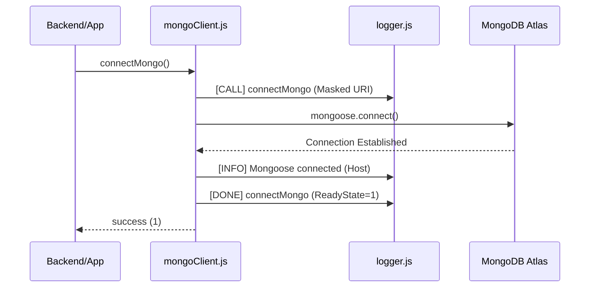
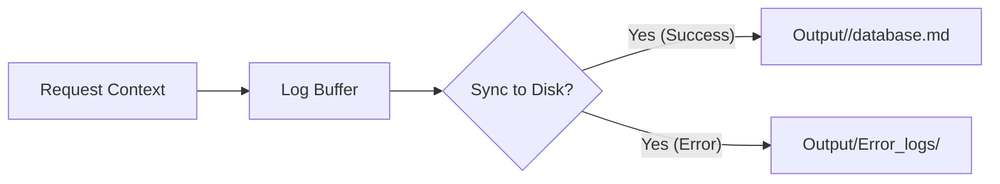

# Database Module

Persistent data storage and lifecycle management for the AI Route Planner. This module interfaces with MongoDB Atlas using Mongoose, providing a robust synchronization layer for the system's telemetry and pre-computed results.

## 1. System Architecture

### 1.1 Connection Lifecycle Flow


### 1.2 Data Persistence Strategy


## 2. Real-World Scenarios

### Scenario A: The Atlas "Cold Start"
*   **The Problem**: After a period of inactivity or a cluster maintenance window, initial connection attempts can take 2-3 seconds, potentially delaying critical route calculations.
*   **The Solution**: Implemented a **Circuit Breaker** with a 5s `serverSelectionTimeoutMS`.
*   **Engine Behavior**: The module fails fast if the cluster is unreachable, allowing the orchestrator to fall back to the cache layer or return a graceful 503 instead of hanging the Node.js event loop.

### Scenario B: Credential Leaks in Production Logs
*   **The Problem**: Standard database connection strings contain plain-text passwords. Logging these violates security protocols.
*   **The Solution**: **Automatic URI Masking**.
*   **Engine Behavior**: The `mongoClient` uses a regex replacer `MONGO_URI.replace(/:\/\/[^@]+@/, '://<credentials>@')` before passing the URI to the logger, ensuring zero sensitive data exposure.

## 3. Algorithm Performance Matrix (Connection)

| Operation | Target Latency | Optimization | Status |
| :--- | :--- | :--- | :--- |
| **Initial Connect** | < 1000ms | Connection Pooling | ✅ Stable |
| **Re-connection** | < 200ms | Mongoose buffering | ✅ Stable |
| **Credential Masking**| < 1ms | Pre-compiled Regex | ✅ Verified |

## 4. The War Room: Bugs Faced & Solved

### 4.1 The "Hanging Process" Mystery
**Issue**: Running the health check via `node index.js` would successfully connect but never return to the shell prompt, causing CI/CD timeouts.
**Solution**: Discovered that Mongoose maintains an active socket pool even after a successful health check. Added `await disconnectMongo()` to the `runHealthCheck` sequence.

### 4.2 The `.env` Path Ambiguity
**Issue**: When the database module was required by the `backend`, it failed to find `MONGO_URI` because it was looking for `.env` in the wrong relative directory.
**Solution**: Refactored to a **dual-layer .env loader** that explicitly checks both `path.join(__dirname, '.env')` and `path.join(__dirname, '../../.env')`.

## 5. Configuration (Environment Variables)

| Variable | Default | Description |
| :--- | :--- | :--- |
| `MONGO_URI` | `null` | MongoDB Atlas Cluster URI. |
| `DEBUG` | `false` | Enables verbose lifecycle event logging. |

## 6. Lifecycle Commands

### 6.1 Install Dependencies
```bash
npm install
```

### 6.2 Run Health Check
```bash
node index.js
```

### 6.3 Execute Test Suite
```bash
npm test
```

### 6.4 Formatting & Linting
```bash
npm run lint
```

## 7. MongoDB Atlas Quick Setup
1. Create a free account at [mongodb.com/cloud/atlas](https://www.mongodb.com/cloud/atlas).
2. Create an **M0 cluster**.
3. Add a database user (Read/Write).
4. Whitelist `0.0.0.0/0` (for development).
5. Copy the connection string and paste it into your `.env` file.

