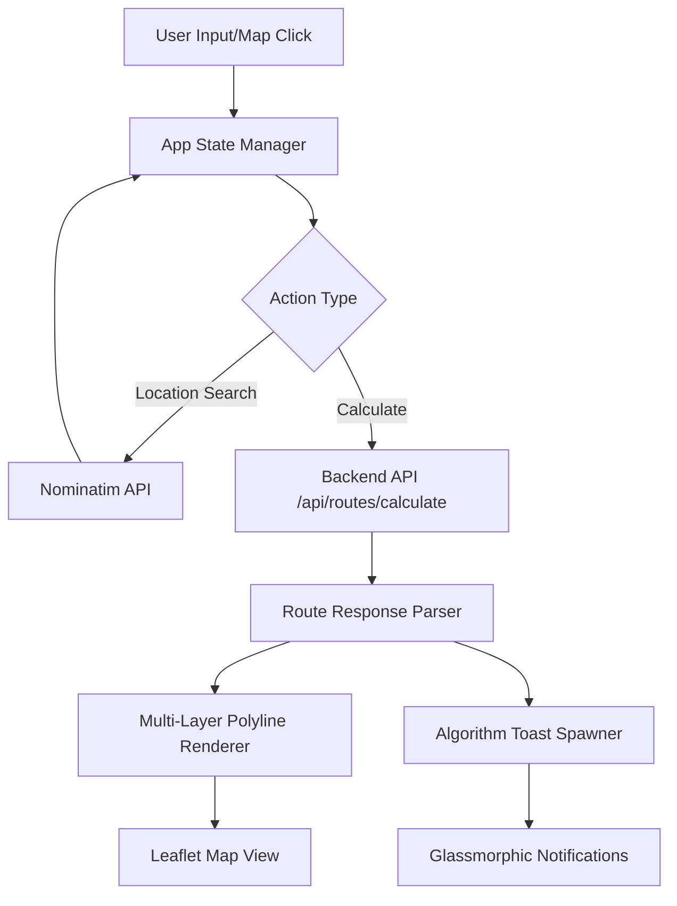
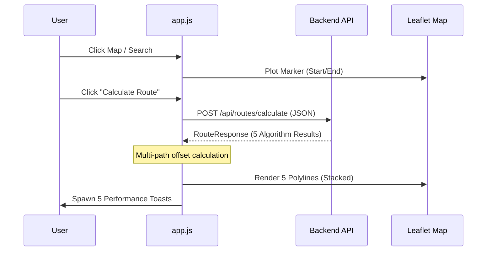

# AI Route Planner - Frontend Module

The Frontend module provides an intuitive, high-fidelity interactive map interface for the AI Route Planner. Built with vanilla technologies and Leaflet.js, it delivers a premium user experience characterized by glassmorphism, fluid animations, and real-time algorithmic feedback.

## 1. System Architecture

### 1.1 High-Level Interaction Flow


### 1.2 Data Orchestration Sequence


## 2. Real-World Scenarios

### Scenario A: The "Identical Path" Overlap
*   **The Problem**: Multiple algorithms (e.g., A* and Dijkstra) often return identical optimal paths. If rendered directly, the polylines would overlap perfectly, hiding the multi-algorithm nature of the results.
*   **The Solution**: **Dynamic Pixel Offsetting**.
*   **Behavior**: The frontend detects identical polylines and groups them into a "bundle." Each path is then offset by a specific pixel width calculated based on the zoom level, creating a distinct "multi-lane" visual effect.

### Scenario B: High-Latency Comparison Suite
*   **The Problem**: Running 5 complex algorithms in parallel on the backend can take 1-2 seconds. Without feedback, the user might think the app is frozen.
*   **The Solution**: **Staggered Glassmorphic Toasts**.
*   **Behavior**: As soon as the API returns, toasts enter the viewport with a 100ms stagger and slide-in animations. A loading state is maintained on the primary button until all results are rendered.

## 3. The War Room: Bugs Faced & Solved

| Issue | Root Cause | Resolution |
| :--- | :--- | :--- |
| **Polyline Drift** | Lat/Lng offsets caused paths to "float" off roads when zooming. | Refactored to **Pixel-Space Offsets** calculated at `zoomend`. |
| **Search Debounce Lag** | Rapid typing triggered 10+ API calls per second to Nominatim. | Implemented **800ms Debounce** with search-on-spacebar trigger. |
| **Toast Overflow** | 5 large notifications covered the entire map on mobile devices. | Implemented **Auto-Minimization** after 60s and a compact 40px view. |
| **DOM Node Leak** | Resetting the map didn't destroy previous event listeners. | Centralized event management and used `.off()` for Leaflet events. |

## 4. 🚀 Quick Start

1. Install dependencies (for linting):
   ```bash
   npm install
   ```
2. Open `index.html` in your browser.
3. Ensure the Backend module is running on `http://localhost:3000`.

## 5. 🏗️ Features

- **Glassmorphic UI**: High-fidelity control panels and notifications with backdrop filters.
- **Pixel-Perfect Bundling**: Visualizes overlapping routes as distinct stacked paths.
- **Interaction Hover**: Hovering a performance card highlights the specific path on the map.
- **Smart Search**: Autocomplete suggestions via Nominatim with intelligent debouncing.
- **Multi-Theme Support**: Toggle between Dark, Light, and Satellite imagery on the fly.

## 6. 🛠️ Tech Stack

- **Logic**: ES6+ JavaScript (Vanilla).
- **Mapping**: Leaflet.js.
- **Styling**: Vanilla CSS3 with Custom Variables.
- **Linter**: ESLint (Flat Config).

## 7. 🧪 Testing & Quality

Execute the test suite:
```bash
npm test
```
Run the linter:
```bash
npm run lint
```

---
*Refer to `module-spec.md` for full implementation boundaries.*
