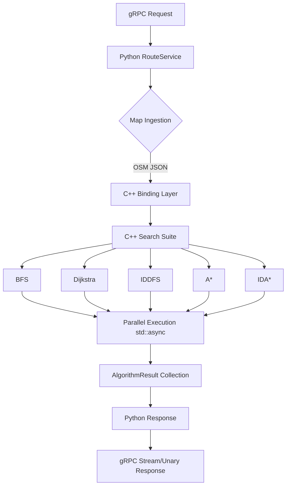
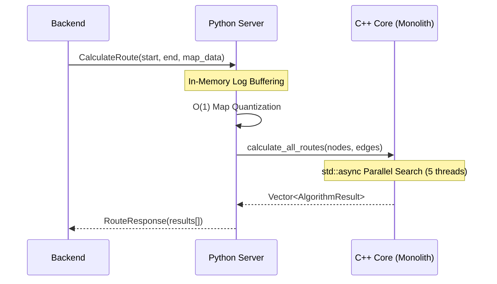

# AI Routing Engine Module

High-performance, multi-algorithm pathfinding core implemented in C++17 with a Python 3.8+ gRPC interface. Designed for sub-second route comparisons on dynamic OpenStreetMap (OSM) data.

## 1. System Architecture

### 1.1 High-Level Flow


### 1.2 gRPC Bridge Flow


## 2. Real-World Scenarios

### Scenario A: Peak-Hour Chaos on NH-52
*   **The Problem**: During 9:00 AM rush hour, primary roads experience 2.0x delay. A simple BFS or hop-count algorithm would route through the highway, leading to a "faster" looking path that is actually slower due to congestion.
*   **The Solution**: Dijkstra and A* utilize the `mock_hour` parameter to apply road-type multipliers.
*   **Engine Behavior**: The engine identifies that a longer secondary road path is 15% faster than the congested primary highway.

### Scenario B: The "Ghost Node" Disconnection
*   **The Problem**: OSM data is often fragmented. If a user requests a route from a pedestrian-only island to a mainland highway, traditional DFS/BFS might expand $10^6$ nodes before failing.
*   **The Solution**: **Island Detection**.
*   **Engine Behavior**: A pre-routing BFS identifies that the `start` and `end` nodes belong to different disconnected components. The suite aborts in <1ms, saving CPU cycles.

## 3. Algorithm Performance Matrix

| Algorithm | Optimization | Best Use Case | Optimality |
| :--- | :--- | :--- | :--- |
| **BFS** | $O(V+E)$ | Hop-count routing | Not Guaranteed |
| **Dijkstra** | $O(E \log V)$ | Guaranteed shortest/fastest | Guaranteed |
| **IDDFS** | Fringe Search | Memory-constrained envs | Guaranteed |
| **A*** | Haversine $h(n)$ | Directed, efficient search | Guaranteed |
| **IDA*** | Epsilon Banding | Heuristic search on large graphs | Guaranteed |

## 4. The War Room: Bugs Faced & Solved

### 4.1 The IDA* Floating Point Pathology
**Issue**: IDA* thresholding works perfectly on integers (grids), but on real-world graphs with `double` costs, the "next threshold" would often increase by only `0.000001`, leading to $10^5$ redundant iterations.
**Solution**: Implemented **Precision Banding** and **Epsilon Cost-Bucketing**. The engine now enforces a minimum threshold jump (`ROUTING_EPSILON_MIN`), drastically reducing iteration count while maintaining admissibility.

### 4.2 The $O(N^2)$ Ingestion Bottleneck
**Issue**: Initial map ingestion used a linear search to match OSM IDs to internal graph indices for every edge. On a 10,000-node map, this was $O(N \cdot E)$ operations.
**Solution**: Refactored to $O(1)$ direct array index lookups by quantifying internal IDs to match node vector indices exactly.

### 4.3 The gRPC Payload "Message Size" Crash
**Issue**: Ingesting large corridors caused `RESOURCE_EXHAUSTED` errors as payloads exceeded the default 4MB gRPC limit.
**Solution**: Reconfigured the Python gRPC server options to support a 100MB `max_receive_message_length` and matched the client-side limits.

## 5. Configuration (Environment Variables)

| Variable | Default | Description |
| :--- | :--- | :--- |
| `ROUTING_MAX_NODES` | `1,000,000` | Circuit breaker for node expansion. |
| `ALGO_DEBUG` | `false` | Deep step-by-step Markdown tracing. |
| `DEBUG_MODE` | `false` | Dummy tracer for gRPC testing. |
| `GRPC_MAX_MESSAGE_SIZE` | `100MB` | Payload limit for large OSM maps. |
| `ROUTING_IDA_BANDING_SHORTEST` | `1.0m` | IDA* threshold jump (meters). |
| `ROUTING_IDA_BANDING_FASTEST` | `0.1s` | IDA* threshold jump (seconds). |
| `GRAPH_CACHE_MAX_SIZE` | `20` | Max number of cached Graph regions. |

## 6. Failure Signature Protocol (v2.0.4)

To ensure the frontend can detect and visualize search failures (e.g., circuit breaker hits), the engine returns a standardized **Failure Signature**:

- **Nodes Expanded**: `ROUTING_MAX_NODES + 1`
- **Distance/Duration**: `0.0`
- **Polyline**: Empty `[]`
- **Flag**: `circuit_breaker_triggered = true`

This triggers a **"LIMIT EXCEEDED"** badge in the UI and red-themed glassmorphism in toast notifications.

## 7. Version History & Updates

### v2.0.4 (Current)
- **Quality Guardian**: Implemented Failure Signature protocol across all 5 algorithms.
- **Robustness**: Added NaN/Inf weight validation for dynamic ingestion.
- **Doc**: Full Doxygen/PEP257 comment coverage.

### v2.0.3
- **Observability**: Added `debug_logs` and `circuit_breaker_triggered` to gRPC payload.
- **Diagnostics**: Synchronized A* step-by-step logs.

### v2.0.2
- **Optimization**: Implemented **Iterative Adaptive Banding** with 1.5x geometric overshoot for IDA*.
- **Performance**: Eliminated hardcoded fallbacks in pruning logic.

### v2.0.1
- **Integrity**: Restored 1:1 bi-directional edge parity in Protobuf ingestion.
- **Stability**: Fixed thread-safety race condition in graph cache.

### v2.0.0
- **Migration**: Transitioned to **Protobuf-First Ingestion** (`map_data_pb`).
- **Persistence**: Implemented thread-safe C++ LRU **Graph Cache**.


| Issue | Root Cause | Resolution |
| :--- | :--- | :--- |
| **IDA* Stagnation** | Fractional edge costs causing sub-millimeter threshold jumps. | Implemented **Epsilon Cost-Bucketing** to enforce minimum step size. |
| **O(N²) Ingestion** | Linear search for OSM ID matching during edge creation. | Refactored to **O(1) Array Indexing** using quantized internal IDs. |
| **gRPC Message Exhaustion** | 50k+ Node maps exceeding 4MB default. | Increased `GRPC_MAX_MESSAGE_SIZE` to **100MB** in `server.py`. |
| **NameError: grpc** | Dependency accidentally dropped during refactoring. | Restored `import grpc` and verified via Quality Guardian protocol. |

## 8. Build and Lifecycle

### 8.1 Build C++ Core
```bash
python3 setup.py build_ext --inplace
```

### 8.2 Run Tests
```bash
pytest tests/routing_engine/test_server.py
```

### 8.3 Performance Targets
- **Ingestion Latency**: < 100ms (Cache Hit), < 500ms (Cache Miss/Parse).
- **Search Latency**: < 500ms for 20k node maps.
- **Memory Footprint**: < 200MB per cached region.


## 7. System Integration & Use Cases

### 7.1 Adding a New Heuristic
1. Developer edits `core/engine.cpp` to add a new `get_custom_heuristic()`.
2. Developer runs `python setup.py build_ext --inplace`.
3. Verify in `A*` or `IDA*`.

### 7.2 Manual Algorithm Tracing
Enable deep tracing to understand search pathologies:
```bash
ALGO_DEBUG=true python3 server.py
```
Logs are saved to `Output/Algorithm_logs/` as readable Markdown.
